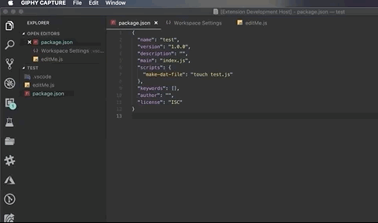

# run-npm-on-save

Run NPM On Save is an [open-source](https://github.com/drkohlipk/vscode-run-npm-on-save 'Open Run NPM On Save on GitHub') extension for [Visual Studio Code](https://code.visualstudio.com)

Provide me an NPM script and I'll run it for you on save :-D!

## Features

   
  
   

Specify the location of your `package.json` and the name of the NPM script that you would like to run on save and watch the magic happen the next time you save a file in your project!

## Extension Settings

This extension contributes the following settings:

- `runNpmOnSave.packageJsonPath`: location of your `package.json` relative to the workspace root. Defaults to the workspace root if not set.
- `runNpmOnSave.scriptToRun`: the name of the NPM script that you would like to run on save.

## Known Issues

Right now, this will run on save of any file no matter the type. Future versions will allow for specific file types and multiple `package.json` and scripts.

## Release Notes

### 0.0.1

First version baby! It will run your specified script when you hit save on any file in your workspace. If you have ideas or bugs, please feel free to create an issue. If you would like to contribute, please do, we would greatly appreciate your help :-D!
